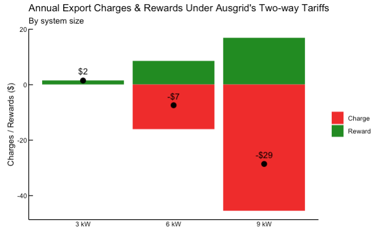

# Economics of Rooftop Solar
_A companion repository to the Centre for Independent Studies paper **[“Rooftop Solar: Paradise Lost”](https://www.cis.org.au/publication/rooftop-solar-paradise-lost)** (May 2025)._

---
## Executive summary
Rooftop PV has been promoted as a doubly virtuous solution to lower household bills **and** supporting the electricity grid's transition to net‑zero. But the following analysis reveals that while solar owners reap significant financial rewards, these benefits come at the expense of non-solar customers. 

* **Bill savings dwarf system value:** Solar households avoid **9–18 ¢ / kWh** on single‑rate plans and **8–16 ¢ / kWh** on time‑of‑use (TOU) plans—roughly **2–4½ ×** the ~4 ¢ / kWh their generation actually saves the National Electricity Market (NEM). Excess bill savings enjoyed by solar customers are recouperated from non-solar households. 
* **The case of Ausgrid:** Before two‑way export tariffs, the average Ausgrid solar customer saves **$705–1 186 / yr** more than the value delivered to the grid. Export charges trim this excess to **$538–617 / yr**, effectively eliminating feed-in tariff savings for solar households without batteries, but distortion from exccessive self-consumption savings remains unchanged.
* **Network costs shift to non‑solar users.** Solar households in the Ausgrid network bypass **$200–282 / yr** in network usage charges that will be recovered from a shrinking volume of delivered energy, pushing charges onto non‑solar customers.

---
## 1 · Cost & adoption trends

**Cost of rooftop solar declined dramatically from early 2000s**

**Mass uptake post‑2010 with steadily larger system sizes**

**During the mass adoption phase (post-2010) households have purchased the largest possible system size that costed no more than $10k**

---
## 2 · High financial returns drive uptake

**Commonwealth rebates front‑loaded the early boom.**

**Australian households were significantly subsidised to take up rooftop solar.**

**At it's peak the Solar Bonus Scheme offered NSW residents 6x the subsequent market feed-in tariff rates**

**Compelling historical financial returns from rooftop solar drove mass adoption**

---
## 3 · Actual value to the grid

**Displacing 24.5 TWh of coal & gas avoided **≈ $1 bn**, equal to **~4 ¢ / kWh** of rooftop output.**

---
## 4 · Outsized bill savings across the NEM

**Median solar customer bill savings by DNSP (Jul‑24).**

**Customer‑weighted state averages.**

> Single‑rate customers save 9–18 ¢ / kWh; TOU 8–16 ¢ / kWh — **well above** the 4 ¢ / kWh system benefit.

---
## 5 · Ausgrid two‑way export tariffs

**Average seasonal load vs PV output in the Ausgrid solar customer sample.**

**Net export charge reaches at **$29 / yr** for a 9 kW system if households do not curtail.**

### Annual bill savings before and after Ausgrid's two-way export tariffs (assuming households curtail export to avoid any export charges):

**Before tariffs**  |  **After tariffs**
:--:|:--:
 | 

*Even with export charges, excess savings remain because of substantial self‑consumption savings.*

---
## 6 · Avoided network usage charges

| Single‑rate | Time‑of‑use |
|---|---|
|  |  |

Solar households sidestep **$200–282 / yr** in DUoS charges; networks must recover this from a smaller delivered‑energy base.

---
## Repository map
| Folder | Purpose |
|--------|---------|
| `/01-inputs` | Raw CSV/XLSX datasets used in the analysis.|
| `/02-scripts` | Quarto (`*.qmd`) analysis notebooks. |
| `/03-outputs` | All figures used in the paper & this README. |

